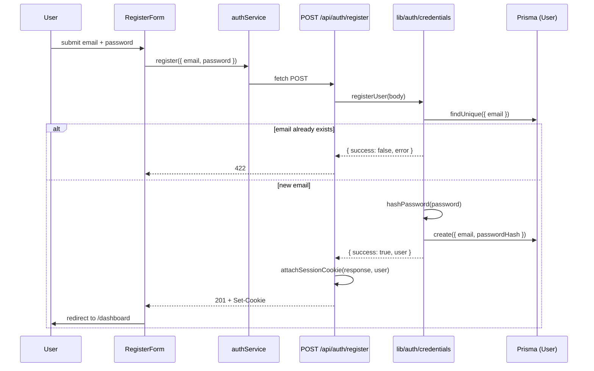
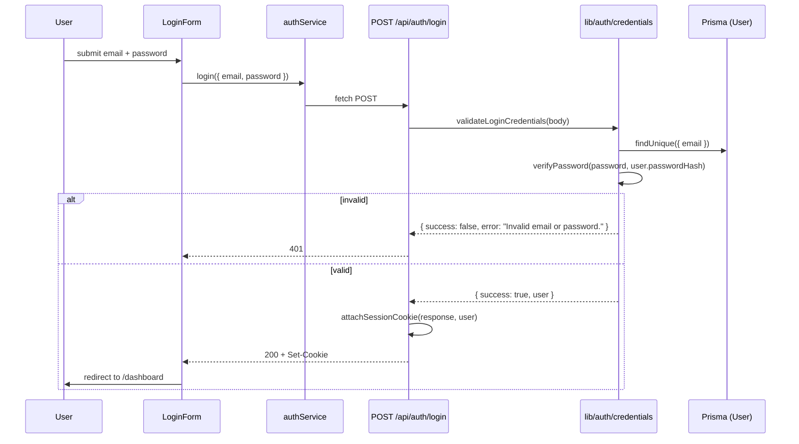
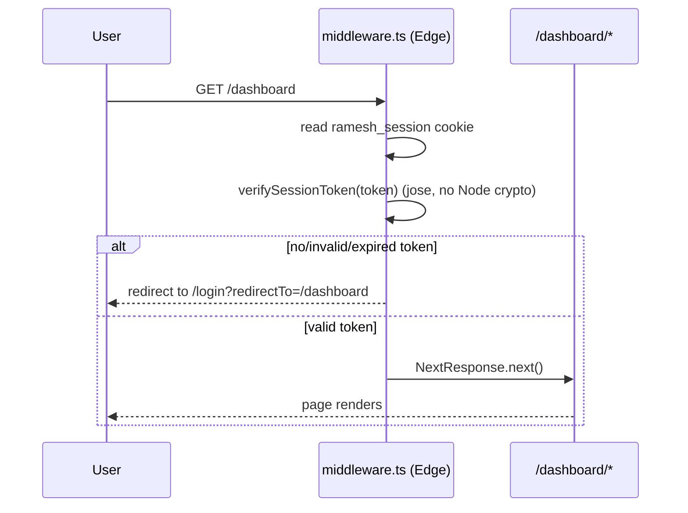

# Auth Module — Flow Diagrams

## Registration

```mermaid
sequenceDiagram
    participant U as User
    participant F as RegisterForm
    participant S as authService
    participant R as POST /api/auth/register
    participant C as lib/auth/credentials
    participant DB as Prisma (User)

    U->>F: submit email + password
    F->>S: register({ email, password })
    S->>R: fetch POST
    R->>C: registerUser(body)
    C->>DB: findUnique({ email })
    alt email already exists
        C-->>R: { success: false, error }
        R-->>F: 422
    else new email
        C->>C: hashPassword(password)
        C->>DB: create({ email, passwordHash })
        C-->>R: { success: true, user }
        R->>R: attachSessionCookie(response, user)
        R-->>F: 201 + Set-Cookie
        F->>U: redirect to /dashboard
    end
```

## Login

```mermaid
sequenceDiagram
    participant U as User
    participant F as LoginForm
    participant S as authService
    participant R as POST /api/auth/login
    participant C as lib/auth/credentials
    participant DB as Prisma (User)

    U->>F: submit email + password
    F->>S: login({ email, password })
    S->>R: fetch POST
    R->>C: validateLoginCredentials(body)
    C->>DB: findUnique({ email })
    C->>C: verifyPassword(password, user.passwordHash)
    alt invalid
        C-->>R: { success: false, error: "Invalid email or password." }
        R-->>F: 401
    else valid
        C-->>R: { success: true, user }
        R->>R: attachSessionCookie(response, user)
        R-->>F: 200 + Set-Cookie
        F->>U: redirect to /dashboard
    end
```

## Route protection (middleware)

```mermaid
sequenceDiagram
    participant U as User
    participant M as middleware.ts (Edge)
    participant P as /dashboard/*

    U->>M: GET /dashboard
    M->>M: read ramesh_session cookie
    M->>M: verifySessionToken(token)  (jose, no Node crypto)
    alt no/invalid/expired token
        M-->>U: redirect to /login?redirectTo=/dashboard
    else valid token
        M->>P: NextResponse.next()
        P-->>U: page renders
    end
```
