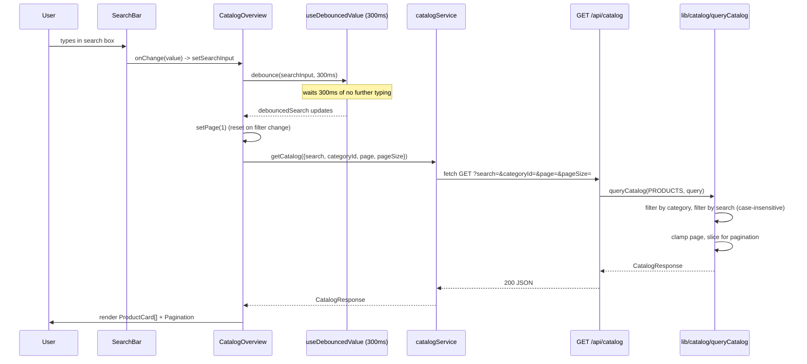
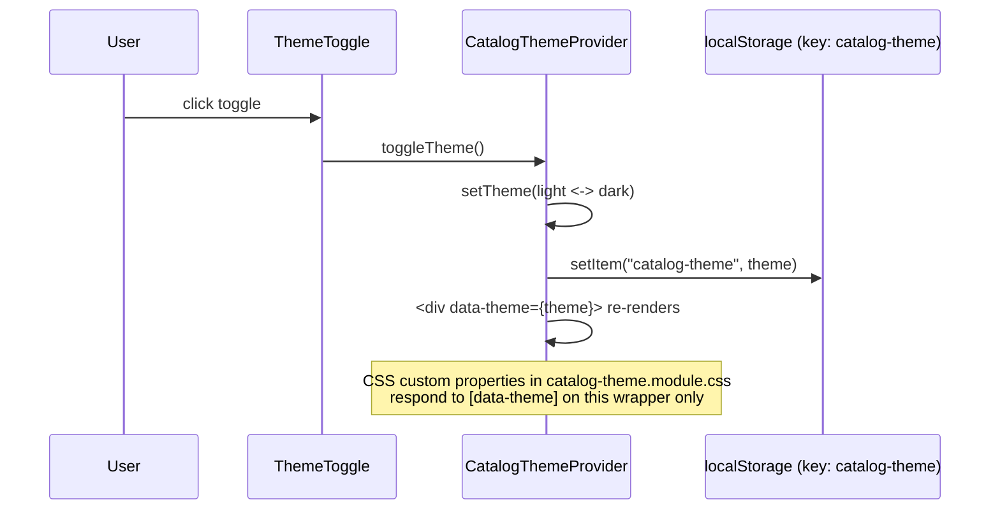

# Catalog Module — Flow Diagram

## Search / filter / pagination

```mermaid
sequenceDiagram
    participant U as User
    participant SB as SearchBar
    participant O as CatalogOverview
    participant D as useDebouncedValue (300ms)
    participant S as catalogService
    participant R as GET /api/catalog
    participant Q as lib/catalog/queryCatalog

    U->>SB: types in search box
    SB->>O: onChange(value) -> setSearchInput
    O->>D: debounce(searchInput, 300ms)
    Note over D: waits 300ms of no further typing
    D-->>O: debouncedSearch updates
    O->>O: setPage(1)  (reset on filter change)
    O->>S: getCatalog({search, categoryId, page, pageSize})
    S->>R: fetch GET ?search=&categoryId=&page=&pageSize=
    R->>Q: queryCatalog(PRODUCTS, query)
    Q->>Q: filter by category, filter by search (case-insensitive)
    Q->>Q: clamp page, slice for pagination
    Q-->>R: CatalogResponse
    R-->>S: 200 JSON
    S-->>O: CatalogResponse
    O->>U: render ProductCard[] + Pagination
```

## Theme toggle (scoped to this page only)

```mermaid
sequenceDiagram
    participant U as User
    participant T as ThemeToggle
    participant P as CatalogThemeProvider
    participant LS as localStorage (key: catalog-theme)

    U->>T: click toggle
    T->>P: toggleTheme()
    P->>P: setTheme(light <-> dark)
    P->>LS: setItem("catalog-theme", theme)
    P->>P: <div data-theme={theme}> re-renders
    Note over P: CSS custom properties in catalog-theme.module.css<br/>respond to [data-theme] on this wrapper only
```
