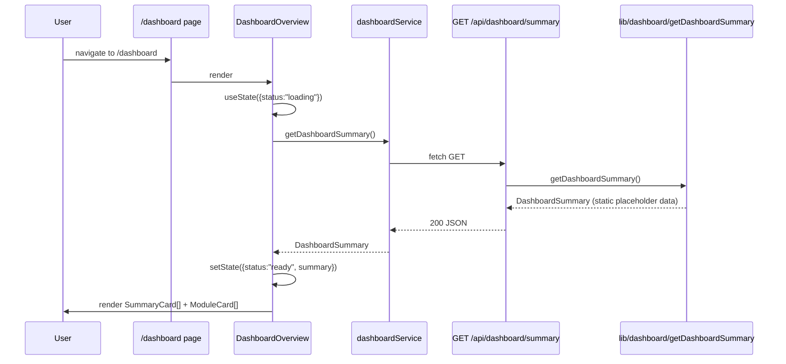

# Dashboard Module — Flow Diagram

```mermaid
sequenceDiagram
    participant U as User
    participant P as /dashboard page
    participant O as DashboardOverview
    participant S as dashboardService
    participant R as GET /api/dashboard/summary
    participant L as lib/dashboard/getDashboardSummary

    U->>P: navigate to /dashboard
    P->>O: render
    O->>O: useState({status:"loading"})
    O->>S: getDashboardSummary()
    S->>R: fetch GET
    R->>L: getDashboardSummary()
    L-->>R: DashboardSummary (static placeholder data)
    R-->>S: 200 JSON
    S-->>O: DashboardSummary
    O->>O: setState({status:"ready", summary})
    O->>U: render SummaryCard[] + ModuleCard[]
```
