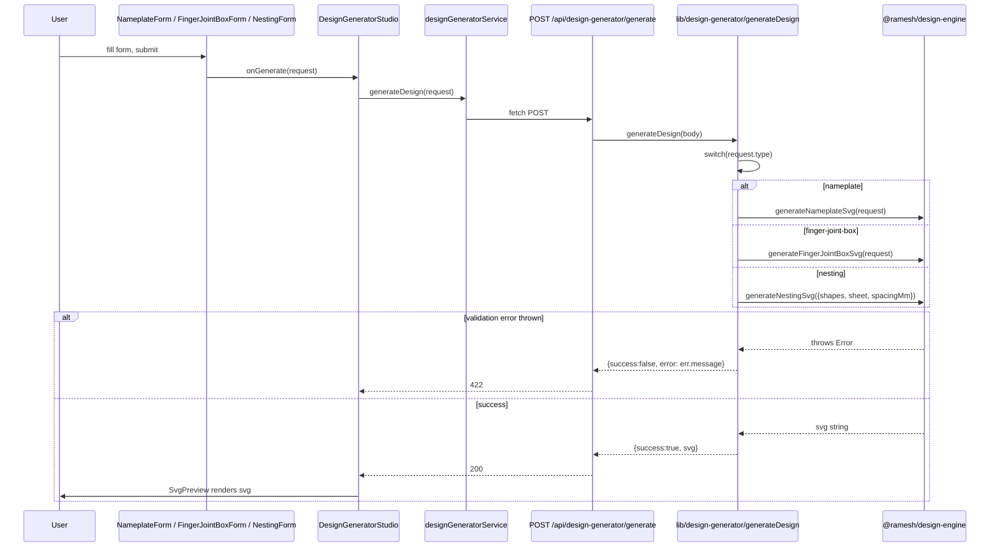
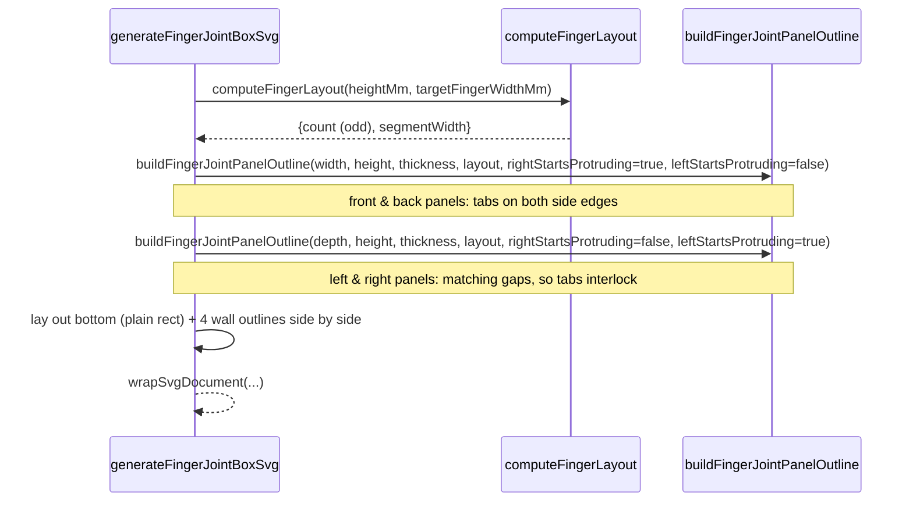

# Design Generator Module — Flow Diagram

## Generate dispatch (any of the 3 types)

```mermaid
sequenceDiagram
    participant U as User
    participant F as NameplateForm / FingerJointBoxForm / NestingForm
    participant St as DesignGeneratorStudio
    participant S as designGeneratorService
    participant R as POST /api/design-generator/generate
    participant D as lib/design-generator/generateDesign
    participant E as @ramesh/design-engine

    U->>F: fill form, submit
    F->>St: onGenerate(request)
    St->>S: generateDesign(request)
    S->>R: fetch POST
    R->>D: generateDesign(body)
    D->>D: switch(request.type)
    alt nameplate
        D->>E: generateNameplateSvg(request)
    else finger-joint-box
        D->>E: generateFingerJointBoxSvg(request)
    else nesting
        D->>E: generateNestingSvg({shapes, sheet, spacingMm})
    end
    alt validation error thrown
        E-->>D: throws Error
        D-->>R: {success:false, error: err.message}
        R-->>St: 422
    else success
        E-->>D: svg string
        D-->>R: {success:true, svg}
        R-->>St: 200
        St->>U: SvgPreview renders svg
    end
```

## Finger-joint box panel geometry (internal, packages/design-engine)

```mermaid
sequenceDiagram
    participant G as generateFingerJointBoxSvg
    participant L as computeFingerLayout
    participant B as buildFingerJointPanelOutline

    G->>L: computeFingerLayout(heightMm, targetFingerWidthMm)
    L-->>G: {count (odd), segmentWidth}
    G->>B: buildFingerJointPanelOutline(width, height, thickness, layout, rightStartsProtruding=true, leftStartsProtruding=false)
    Note over G,B: front & back panels: tabs on both side edges
    G->>B: buildFingerJointPanelOutline(depth, height, thickness, layout, rightStartsProtruding=false, leftStartsProtruding=true)
    Note over G,B: left & right panels: matching gaps, so tabs interlock
    G->>G: lay out bottom (plain rect) + 4 wall outlines side by side
    G-->>G: wrapSvgDocument(...)
```
