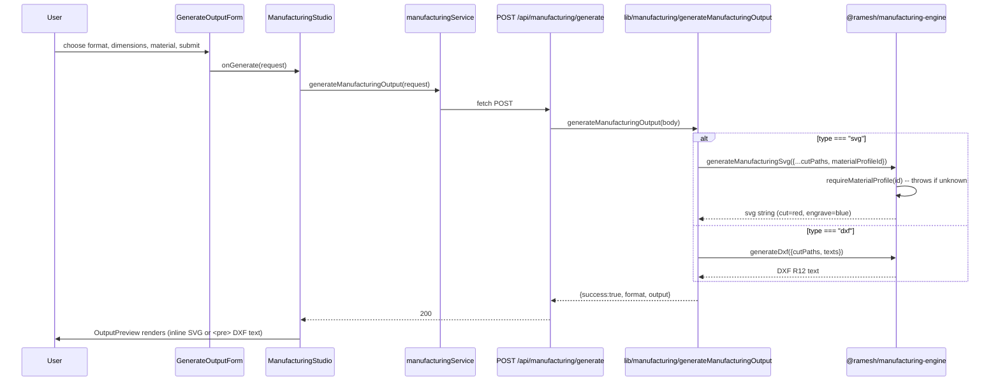
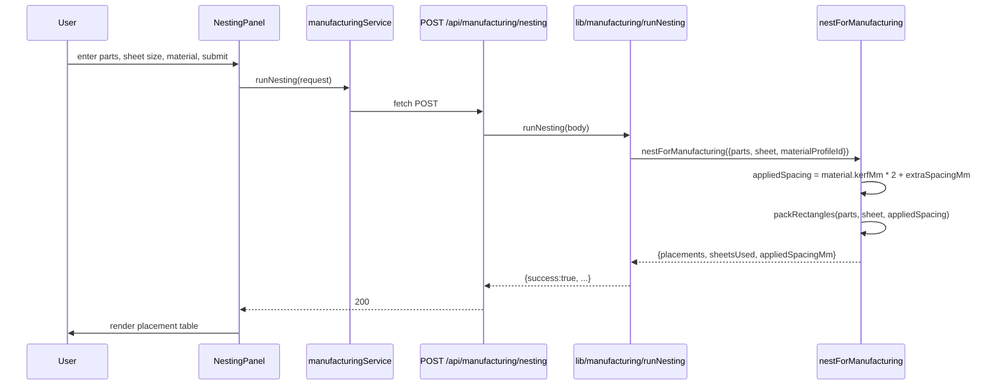
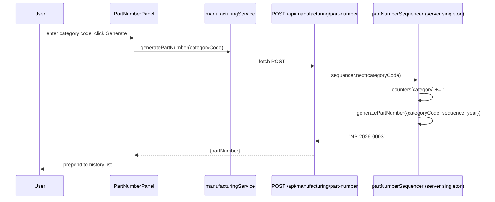

# Manufacturing Module — Flow Diagrams

## Generate (SVG or DXF)

```mermaid
sequenceDiagram
    participant U as User
    participant F as GenerateOutputForm
    participant Sd as ManufacturingStudio
    participant S as manufacturingService
    participant R as POST /api/manufacturing/generate
    participant D as lib/manufacturing/generateManufacturingOutput
    participant E as @ramesh/manufacturing-engine

    U->>F: choose format, dimensions, material, submit
    F->>Sd: onGenerate(request)
    Sd->>S: generateManufacturingOutput(request)
    S->>R: fetch POST
    R->>D: generateManufacturingOutput(body)
    alt type === "svg"
        D->>E: generateManufacturingSvg({...cutPaths, materialProfileId})
        E->>E: requireMaterialProfile(id)  -- throws if unknown
        E-->>D: svg string (cut=red, engrave=blue)
    else type === "dxf"
        D->>E: generateDxf({cutPaths, texts})
        E-->>D: DXF R12 text
    end
    D-->>R: {success:true, format, output}
    R-->>Sd: 200
    Sd->>U: OutputPreview renders (inline SVG or <pre> DXF text)
```

## Nesting

```mermaid
sequenceDiagram
    participant U as User
    participant P as NestingPanel
    participant S as manufacturingService
    participant R as POST /api/manufacturing/nesting
    participant N as lib/manufacturing/runNesting
    participant E as nestForManufacturing

    U->>P: enter parts, sheet size, material, submit
    P->>S: runNesting(request)
    S->>R: fetch POST
    R->>N: runNesting(body)
    N->>E: nestForManufacturing({parts, sheet, materialProfileId})
    E->>E: appliedSpacing = material.kerfMm * 2 + extraSpacingMm
    E->>E: packRectangles(parts, sheet, appliedSpacing)
    E-->>N: {placements, sheetsUsed, appliedSpacingMm}
    N-->>R: {success:true, ...}
    R-->>P: 200
    P->>U: render placement table
```

## Part numbering

```mermaid
sequenceDiagram
    participant U as User
    participant P as PartNumberPanel
    participant S as manufacturingService
    participant R as POST /api/manufacturing/part-number
    participant Q as partNumberSequencer (server singleton)

    U->>P: enter category code, click Generate
    P->>S: generatePartNumber(categoryCode)
    S->>R: fetch POST
    R->>Q: sequencer.next(categoryCode)
    Q->>Q: counters[category] += 1
    Q->>Q: generatePartNumber({categoryCode, sequence, year})
    Q-->>R: "NP-2026-0003"
    R-->>P: {partNumber}
    P->>U: prepend to history list
```
